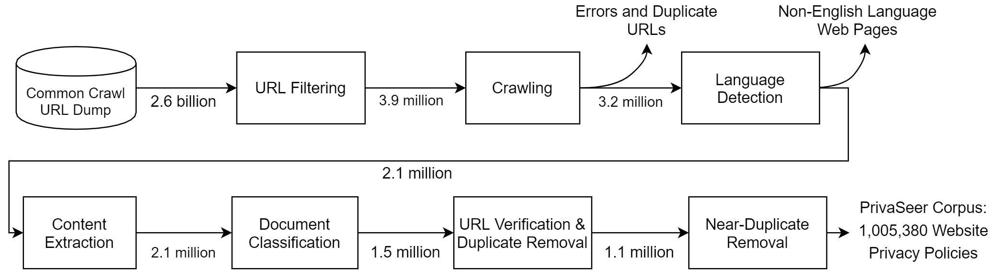

# Privacy at Scale: Introducing the PrivaSeer Corpus of Web Privacy Policies

This repository contains information regarding the resources in the ACL 2021 paper "Privacy at Scale: Introducing the PrivaSeer Corpus of Web Privacy Policies." 

PrivaSeer Corpus: https://git.psu.edu/hlt-lab/PrivaSeer-Corpus

## PrivaSeer Corpus

The PrivaSeer Corpus is a large-scale dataset of web privacy policies. The dataset contains ~4 million privacy policies. This repository contains processing pipeline for creating the first version of the Corpus. Additinally, it contains the code for pretrainig PrivBERT a privacy policy langauge model and performing validation experiemnts such as privacy policy classification and question answering.

## PrivaSeer Corpus Processing Pipeline



## PrivaSeer Corpus Pretraining

We used the above pipeline to pretrain PrivBERT on the PrivaSeer Corpus. PrivBERT is available at https://huggingface.co/mukund/privbert.

## Citation

If you use the PrivaSeer Corpus in your research, please cite the following paper:

```
@inproceedings{srinath2021privacy,
  title={Privacy at Scale: Introducing the PrivaSeer Corpus of Web Privacy Policies},
  author={Srinath, Mukund and Wilson, Shomir and Giles, C Lee},
  booktitle={Proceedings of the 59th Annual Meeting of the Association for Computational Linguistics and the 11th International Joint Conference on Natural Language Processing (Volume 1: Long Papers)},
  pages={6829--6839},
  year={2021}
}
```